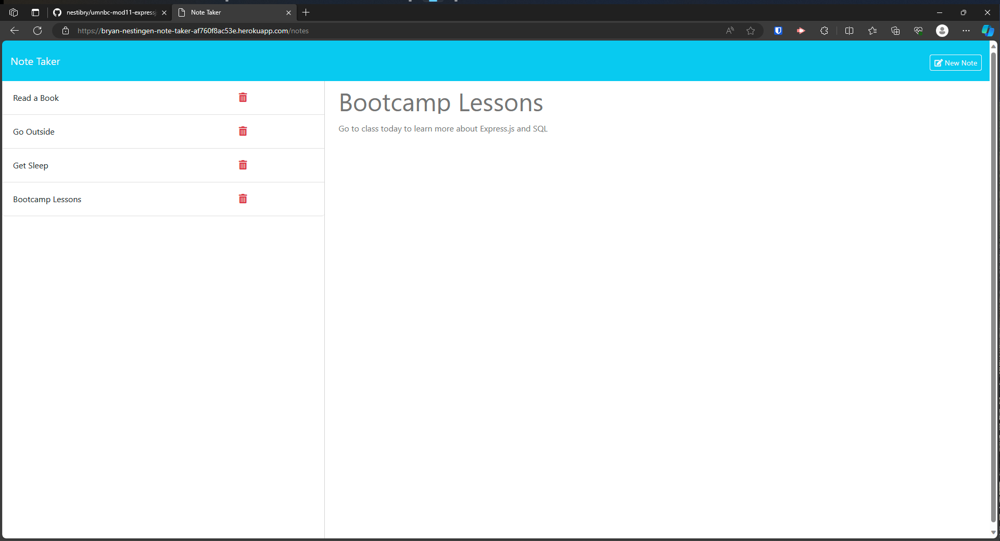

# Express.js Note Taker
*University of Minnesota - Coding Boot Camp - Module 11 Express.js Challenge*


## Description

A note taker application that can be used to write and save notes. This application uses an Express.js back-end and saves and retrieves note data from a JSON file.


## Table of Contents
- [Usage](#usage)
- [Installation](#installation)
- [Contributing](#contributing)
- [Questions](#questions)
- [License](#license)

## Usage

#### Deployed Site: https://bryan-nestingen-note-taker-af760f8ac53e.herokuapp.com/





## Installation 
#### Invoking the application locally

1. Install Node.js locally
2. Clone or Fork the Repo
3. Open Repo Directory in VS Code Integrated Terminal (or Git Bash)
4. Execute `npm install` to install dependencies and `npm i -D nodemon` or `npm i -g nodemon`
4. Execute `nodemon server.js` in a bash command-line
5. Open `http://localhost/3001`


#### Execute the following in a bash command-line to install dependencies and invoke the application:
```
npm install 
npm i -D nodemon
nodemon server.js
```

#### Main Files: 

- server.js
- public/assets/js/index.js
- db/db.json
- package.json
- README.md
- public/
    - index.html
    - notes.html


## Contributing
- Please send an email to the code owner before contributing; see the questions section for contact information. 
- Please follow the [Contributor Covenant](https://www.contributor-covenant.org/) when contributing.

## Questions

- GitHub Profile: [nestibry](https://github.com/nestibry)
- Please email me at [nestibry@gmail.com](mailto:nestibry@gmail.com) with any questions

## Credits
- © 2023 edX Boot Camps LLC.

## License

- The content of this application is licensed under the [MIT License](https://choosealicense.com/licenses/mit/)

